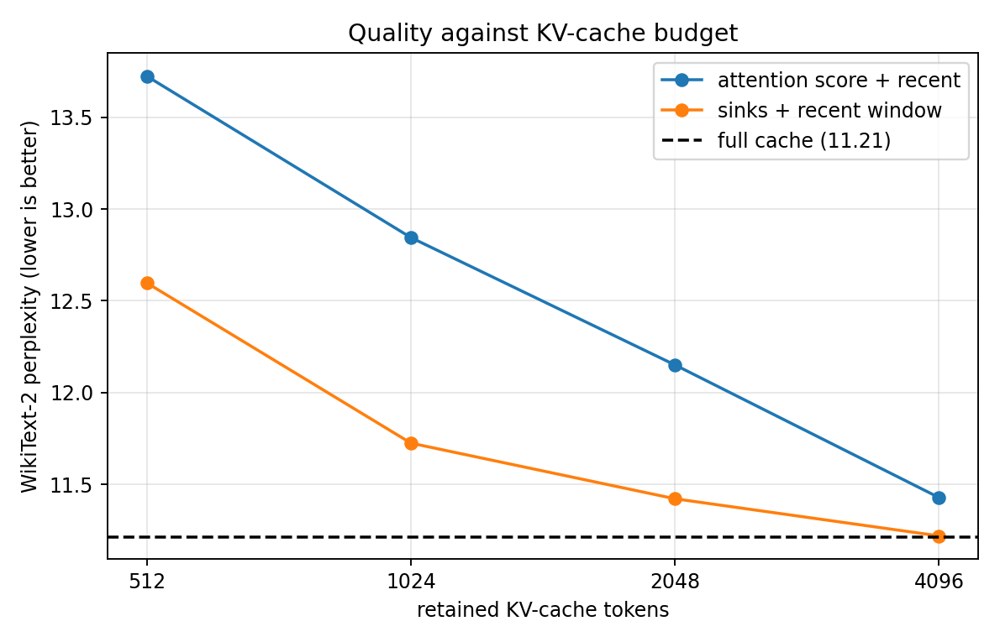
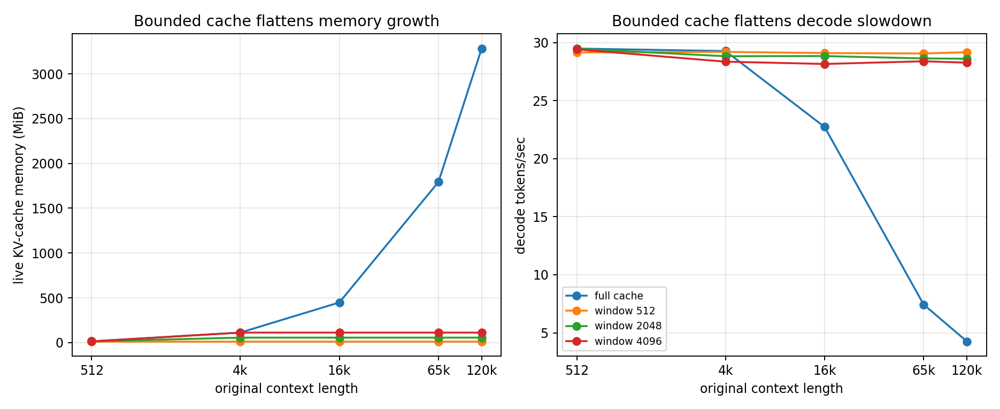

# KV-cache eviction: quality, memory, and decode speed

A small recent window was a stronger cache policy than the attention-score
heuristic in this experiment. Keeping 4,096 of 6,144 tokens with four attention
sinks cut live KV memory from 168 to 112 MiB while moving WikiText-2 perplexity
from 11.213 to 11.219, only 0.06%. A 2,048-token cache saved 67% of the memory
for a 1.86% perplexity increase. Below that point, quality degraded quickly.

At 120,000 tokens of original context, a full cache occupied 3,281.6 MiB and
decoded at 4.26 tokens/sec. Bounding the live cache to 512 tokens held it at
14 MiB and 29.17 tokens/sec, a 6.84x speedup and 99.57% memory reduction.



## Method

The model was Qwen2.5-1.5B in fp16 on one RTX 3060 12GB. The box ran CUDA
12.8, torch 2.11.0+cu128, transformers 4.46.3, and datasets 3.1.0. Its measured
streaming-read ceiling was 340.9 GB/s and its measured fp16 tensor throughput
was 26.15 TFLOP/s. No number from another box appears in the result tables.

The two eviction policies operate on `transformers.DynamicCache` independently
at every layer:

- sinks plus recent window: keep the first four tokens and fill the remaining
  budget with the newest tokens
- attention score plus recent: keep the first four tokens, pin the newest 32,
  and fill the rest with tokens that have the largest cumulative attention mass

The score is the attention mass received from all heads and queries seen so far.
It is a deliberately simple heavy-hitter policy, not an implementation of a
published algorithm such as H2O.

### Quality workload

Quality used one fixed token stream from the WikiText-2 raw test split. The
first 4,096 predictions warmed the cache and were not scored. Perplexity was
computed on the following 2,048 predictions, so the full-cache control ended
with 6,144 retained tokens. Inputs were processed in 32-token chunks.

Cache compaction makes retained KV indices different from their absolute token
positions. The harness therefore supplies an explicit mask: every retained old
key is visible, while only the new 32-token chunk receives a triangular causal
mask. Without this mask, later tokens inside a chunk can leak into earlier
predictions after eviction and produce invalid, artificially low perplexity.

Attention scores require the eager attention path. In the pinned transformers
version, eager Qwen2 formed the query-key product in fp16 and produced NaN
logits on this torch build even for the full-cache control. The benchmark uses
the same eager implementation with only that matmul moved to fp32 before the
fp32 softmax. The value aggregation and model weights remain fp16. The full
control is therefore measured through the same corrected path as both eviction
policies.

### Systems workload

The systems sweep used the model's unmodified SDPA decode path. It created
correctly shaped synthetic KV tensors at exact starting contexts of 512, 4,096,
16,384, 65,536, and 120,000 tokens. KV values do not change attention runtime,
so this isolates the real one-token decode cost without replaying a quadratic
120,000-token prefill for every configuration.

Each cell reports the median of 20 synchronized wall-clock samples after three
discarded warmups. Full cache and sink-window budgets of 512, 2,048, and 4,096
tokens were measured. The pruning implementation uses `index_select`, so its
copy and allocation overhead is included.

## Quality results

| policy | retained tokens | perplexity | change from full | live KV (MiB) | KV memory saved |
| --- | ---: | ---: | ---: | ---: | ---: |
| full | 6,144 | 11.213 | control | 168 | 0% |
| sinks + window | 4,096 | 11.219 | +0.06% | 112 | 33.3% |
| sinks + window | 2,048 | 11.421 | +1.86% | 56 | 66.7% |
| sinks + window | 1,024 | 11.724 | +4.57% | 28 | 83.3% |
| sinks + window | 512 | 12.597 | +12.35% | 14 | 91.7% |
| attention score + recent | 4,096 | 11.428 | +1.92% | 112 | 33.3% |
| attention score + recent | 2,048 | 12.151 | +8.37% | 56 | 66.7% |
| attention score + recent | 1,024 | 12.844 | +14.55% | 28 | 83.3% |
| attention score + recent | 512 | 13.724 | +22.40% | 14 | 91.7% |

The 4,096-token recent window removed one-third of the context with effectively
unchanged perplexity. The first clear trade-off appears at 2,048 tokens: it
retains one-third of the original context, saves two-thirds of KV memory, and
costs 1.86% in perplexity. The curve then steepens.

The attention-score policy lost to the recent window at every equal budget. Its
perplexity penalty over the window was 0.21 at 4,096 tokens, 0.73 at 2,048, and
about 1.12 at 1,024 and 512. On this contiguous language-modeling stream,
recency was more useful than the old tokens selected by cumulative attention
mass. Attention received in the past is not automatically a good predictor of
which token will matter to the next prediction.

## Memory and speed results



The full-cache curve shows the expected 28 KiB of live KV per token. Bounded
caches make that slope zero once the budget is reached.

| starting context | full-cache KV (MiB) | full tok/s | window 512 tok/s | window 2,048 tok/s | window 4,096 tok/s |
| ---: | ---: | ---: | ---: | ---: | ---: |
| 512 | 14.4 | 29.49 | 29.16 | 29.48 | 29.42 |
| 4,096 | 112.4 | 29.28 | 29.20 | 28.83 | 28.36 |
| 16,384 | 448.4 | 22.74 | 29.10 | 28.84 | 28.16 |
| 65,536 | 1,792.4 | 7.44 | 29.07 | 28.64 | 28.40 |
| 120,000 | 3,281.6 | 4.26 | 29.17 | 28.62 | 28.27 |

At 120,000 tokens, all three windows keep decode near 28 to 29 tokens/sec. The
512, 2,048, and 4,096 budgets are 6.84x, 6.71x, and 6.63x faster than full
cache respectively. Their live KV memories are 14, 56, and 112 MiB, reductions
of 99.57%, 98.29%, and 96.59% from the 3,281.6 MiB full cache.

There is a small short-context cost. At a 4,096-token context, the 4,096-token
window is 3.1% slower than full cache because pruning and copying have overhead
before saved attention work can pay it back. By 16,384 tokens, every bounded
cache is faster. A production ring or static cache could remove much of the
copy cost measured here.

## Relation to the OOM study

The earlier organic OOM sweep measured about 60 KiB of allocated growth per
token, compared with the 28 KiB analytical KV size. Its `torch.cat` growth path
temporarily held old and new buffers and accumulated allocator fragmentation.
This controlled sweep preallocates an exact synthetic context, so it reproduces
the intrinsic 28 KiB live-cache slope. Peak allocation during one decode step
grew at about 34 KiB per original token. These are different instruments:
28 KiB is the live representation, while the earlier 60 KiB was the cost of
organically growing it through repeated reallocations.

## Limitations

- Quality is one 2,048-token scored slice after a 4,096-token warmup. It does
  not establish a universal safe budget for other documents, tasks, or models.
- The score policy is a simple cumulative-attention heuristic with four sinks
  and 32 pinned recent tokens. It was not tuned and should not stand in for
  optimized heavy-hitter or learned eviction methods.
- Quality uses corrected eager attention because scores must be returned;
  performance uses SDPA because it is the normal model path. Quality comparisons
  are internally matched, but eager and SDPA throughput numbers are not mixed.
- Synthetic KV values make the long-context speed sweep practical and valid for
  runtime and memory, but they do not represent meaningful model outputs. All
  quality numbers come from real WikiText tokens and organically produced KV.
- `index_select` copies retained tensors during pruning. A production static,
  paged, or ring cache could reduce that overhead.
- Results are from one model, one GPU, and the pinned library versions above.

## Reproduce

Install the pinned requirements, cache the model and WikiText dataset, and run:

```bash
export HF_HOME=/workspace/hf-cache
python scripts/measure_bandwidth.py
python scripts/bench_eviction.py --mode quality --overwrite
python scripts/bench_eviction.py --mode speed --overwrite
python scripts/plot_eviction.py
```

The raw files are `results/eviction_quality.csv` and
`results/eviction_speed.csv`. The plot script also writes derived
`results/eviction_quality_summary.csv` and
`results/eviction_speed_summary.csv`. Recalibrate every new box and never mix
its rows with this table.
