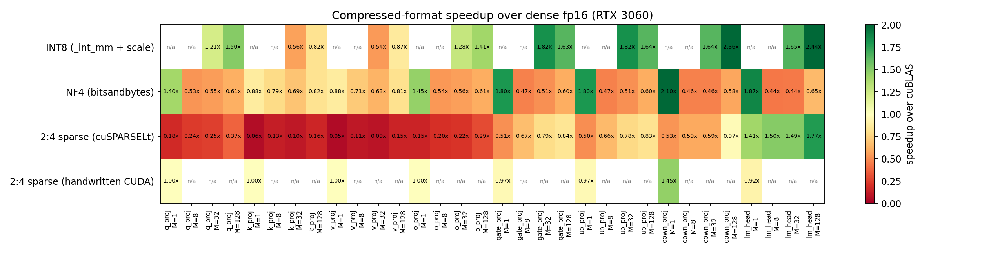
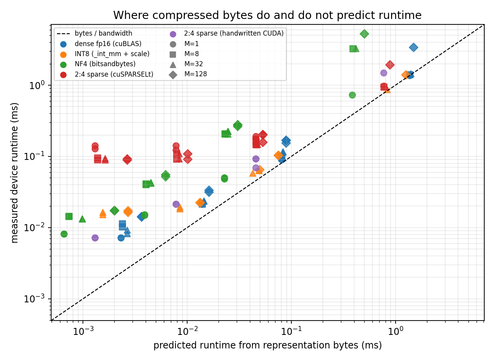

# Compressed tensor formats against the hardware

Compression converted into speed only when the library exposed a kernel for
the exact batch and shape. Weighted by the 197 matmuls in a real Qwen2.5-1.5B
decode step, NF4 cut the `M=1` device time from 10.86 to 6.20 ms, a 1.75x
speedup. At `M=8`, the same format took 23.71 ms and was 2.09x slower than
dense fp16. INT8 did not run at `M=1` or `M=8`, then won by 1.55x at `M=32`
and 1.77x at `M=128`. PyTorch's 2:4 sparse path moved 0.5625x the fp16 weight
bytes but was 2.88x slower than dense at `M=1`.

The bytes model predicted the direction only when the execution path stayed
close to one streaming kernel. Compressed storage is a necessary condition for
a bandwidth win, not a sufficient one.



## Method

The eight shapes are the matmuls extracted from a profiled decode step. `K` is
the input dimension, `N` is the output dimension, and `M` is the number of
tokens sharing the weight read.

| projection | K | N | instances per step |
| --- | ---: | ---: | ---: |
| q_proj | 1536 | 1536 | 28 |
| k_proj | 1536 | 256 | 28 |
| v_proj | 1536 | 256 | 28 |
| o_proj | 1536 | 1536 | 28 |
| gate_proj | 1536 | 8960 | 28 |
| up_proj | 1536 | 8960 | 28 |
| down_proj | 8960 | 1536 | 28 |
| lm_head | 1536 | 151936 | 1 |

Every shape ran at `M` in 1, 8, 32, and 128. All weights use the model's real
`[N, K]` storage layout and multiply through a transpose view. The four library
paths were:

- dense fp16: `torch.mm`, dispatched to cuBLAS
- INT8: `torch._int_mm`, followed by one per-output-column fp32 scaling kernel
  that writes fp16
- NF4: `bitsandbytes.matmul_4bit`, block size 64
- 2:4 sparse fp16: `torch.sparse.to_sparse_semi_structured`, dispatched through
  cuSPARSELt

The fifth path is a handwritten CUDA 2:4 GEMV for `M=1`. It stores two fp16
values per group of four and packs two 4-bit index codes into each metadata
byte. One 256-thread block reduces one output element. Its output was checked
against the same pruned dense matrix on every shape; the largest absolute
difference was 0.25 in fp16 on `down_proj`.

Each reported time is the median of 20 CUDA-event samples after five discarded
warmups. A 64 MiB tensor is streamed immediately before every sample, outside
the timed event interval. This evicts repeated small weights from L2 so the
microbenchmark matches a decode step that walks through all model weights.

The box was the same RTX 3060 used for the energy study: sm_86, CUDA 12.8,
torch 2.11.0+cu128, bitsandbytes 0.49.2. Its measured streaming-read ceiling
was 341.4 GB/s. No result from another box appears in these tables.

## The bytes model

The model counts minimum representation traffic, then divides by 341.4 GB/s.
It includes input and output traffic even though weights dominate at small
`M`.

| format | modeled bytes per `[M,K] x [K,N]` call |
| --- | --- |
| dense fp16 | `2KN + 2MK + 2MN` |
| INT8 | `KN + 4N + MK + 8MN + 2MN` |
| NF4 | `KN/2 + 4 ceil(KN/64) + 64 + 2MK + 2MN` |
| 2:4 sparse fp16 | `KN + KN/8 + 2MK + 2MN` |

The INT8 `8MN` term is the int32 accumulator written by `_int_mm` and read by
the scaling epilogue. The 2:4 representation stores half the fp16 values plus
four index bits per group of four, so weights plus metadata occupy 0.5625x the
dense weight bytes. The NF4 model deliberately counts the compressed
representation, not any temporary dense matrix created by the library. That
extra traffic is one place the prediction can fail.



## Weighted decode-step results

The totals below multiply every projection time by its real instances per
decode step. They are kernel-path totals, not end-to-end token latency: they do
not include attention, normalization, sampling, or CPU launch gaps.

| format | M | bytes-model floor (ms) | measured (ms) | speedup over dense | measured / floor |
| --- | ---: | ---: | ---: | ---: | ---: |
| dense fp16 | 1 | 9.05 | 10.86 | 1.00x | 1.20x |
| NF4 | 1 | 2.55 | 6.20 | 1.75x | 2.43x |
| 2:4 sparse, cuSPARSELt | 1 | 5.09 | 31.28 | 0.35x | 6.14x |
| 2:4 sparse, handwritten CUDA | 1 | 5.09 | 10.26 | 1.06x | 2.01x |
| dense fp16 | 8 | 9.10 | 11.33 | 1.00x | 1.24x |
| NF4 | 8 | 2.60 | 23.71 | 0.48x | 9.10x |
| 2:4 sparse, cuSPARSELt | 8 | 5.15 | 24.47 | 0.46x | 4.75x |
| dense fp16 | 32 | 9.29 | 12.42 | 1.00x | 1.34x |
| INT8 | 32 | 5.33 | 8.01 | 1.55x | 1.50x |
| NF4 | 32 | 2.79 | 24.78 | 0.50x | 8.89x |
| 2:4 sparse, cuSPARSELt | 32 | 5.33 | 24.56 | 0.51x | 4.61x |
| dense fp16 | 128 | 10.02 | 19.86 | 1.00x | 1.98x |
| INT8 | 128 | 7.71 | 11.24 | 1.77x | 1.46x |
| NF4 | 128 | 3.52 | 32.33 | 0.61x | 9.17x |
| 2:4 sparse, cuSPARSELt | 128 | 6.07 | 28.43 | 0.70x | 4.69x |

The derived table is also stored in `results/formats_summary.csv`; all 136 raw
shape-by-format rows are in `results/formats.csv`.

## What the misses mean

### NF4 has two different execution regimes

At `M=1`, bitsandbytes selects its fused 4-bit GEMV and the three large layer
projections run 1.80x to 2.11x faster than dense. The small 1536x256 GQA
projections do not have enough work to convert the byte reduction into a win:
NF4 is 0.88x dense there. Across the real step, the large projections dominate
and NF4 wins 1.75x.

For `M>1`, bitsandbytes 0.49.2 takes a different path: it dequantizes the full
weight to fp16, then calls a dense linear operation. The measured result is 8.9x
to 9.2x above the compressed-byte floor, and NF4 is 1.63x to 2.09x slower than
dense. The representation did not change, but the kernel path did.

### INT8 needs enough M to enter its useful region

This torch build rejects `_int_mm` when `M <= 16`, so INT8 has no result at
`M=1` or `M=8`. That unsupported cell is a result, not padded away with extra
work. At `M=32`, INT8 wins on q, o, the three MLP projections, and `lm_head`,
but loses on the two 1536x256 GQA projections. Weighted across the step it is
1.55x faster. The win rises to 1.77x at `M=128`.

The weighted INT8 runtime is 1.46x to 1.50x its byte floor, close to dense's
1.34x to 1.98x. Once the shape is supported and large enough, byte traffic is a
useful predictor again.

### cuSPARSELt has a shape floor

The library 2:4 path wins only on the 466.7 MB `lm_head`: 1.41x at `M=1`,
1.49x at `M=8` and `M=32`, and 1.77x at `M=128`. It takes about 0.10 to 0.20 ms
even on smaller projections. That floor makes it 18x to 20x slower than dense
on the two 0.79 MB GQA weights at `M=1`, and it loses on every layer projection
at every `M` in this sweep.

The full-step sparse total is 4.6x to 6.1x its byte floor. cuSPARSELt can turn
sparsity into speed when the matrix is large enough, but its available kernel
is not a drop-in decode GEMV win on this card.

### The handwritten kernel removes the library floor, not every bottleneck

The CUDA GEMV cuts the `down_proj` time from 0.101 to 0.070 ms, a 1.45x win,
and matches dense within one CUDA-event tick on four smaller projections. It is
slower on `lm_head` because its one-block-per-output reduction does not match
cuBLAS or cuSPARSELt on the largest matrix. Weighted across the step it is 1.06x
faster than dense, far below the 1.78x storage ratio ceiling.

This separates two claims. The library's 2:4 loss on small shapes is not proof
that compressed bytes cannot help: a simple kernel removes most of that fixed
cost. But compressed storage alone still does not supply the scheduling,
vectorization, and tensor-core use needed to reach the byte floor.

## Limitations

- This is a kernel study on synthetic values. It does not measure model quality
  after quantization or 2:4 pruning.
- The INT8 input is already quantized. Activation quantization cost is excluded,
  so the reported INT8 result is favorable to INT8. The scaling epilogue is
  included.
- Only bitsandbytes 0.49.2, torch 2.11.0, and the kernels selected on sm_86 are
  measured. Different versions can move or remove the regime boundaries.
- The analytical line is a minimum-traffic floor. It does not model launch
  latency, occupancy, internal workspace, dequantized temporaries, or the
  transition to compute-bound execution at larger `M`.
- The handwritten kernel supports only fp16 2:4 GEMV at `M=1`. It is an
  implementation comparison, not a production sparse GEMM library.

## Reproduce

Run in Environment A on a CUDA GPU with `nvcc` and `ninja` available:

```bash
python scripts/measure_bandwidth.py
python scripts/bench_formats.py --bandwidth-gbs 341.4 --overwrite
python scripts/plot_formats.py
```

The first command must be rerun on a new box. Pass that box's measured
achievable read bandwidth to the benchmark, and never combine its rows with
this table.
