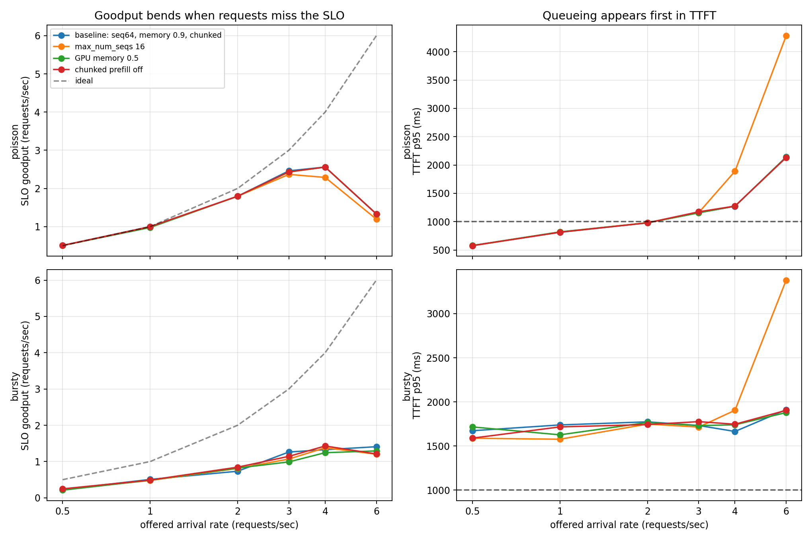
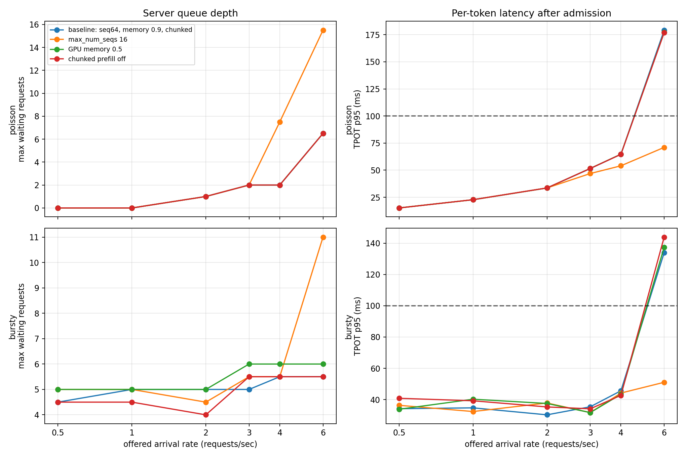

# Serving under load: the average rate hides the burst

Phase 3 study 4. Every earlier benchmark handed the engine a fixed batch. This
study runs vLLM as a real server, streams mixed-length requests into it, and
asks where useful capacity ends under steady and bursty arrivals. The raw rows
are in `results/load_requests.csv`, `results/load_runs.csv`, and
`results/load_metrics.csv`. The derived tables and figures are
`results/load_summary.csv`, `results/load_knees.csv`,
`results/load_knees.png`, and `results/load_scheduler.png`.

Three findings:

1. **The Poisson SLO capacity is 2 requests/s.** The baseline holds 92.7% SLO
   attainment with 979 ms TTFT p95 and 33.6 ms TPOT p95 at 2 requests/s. At
   3 requests/s, TTFT p95 rises to 1.16 s and attainment falls to 89.6%, so
   the first-token tail marks the knee before decode latency does.
2. **An eight-request burst misses the SLO even at 0.5 requests/s on average.**
   Baseline TTFT p95 is 1.67 s and only 45.8% of requests pass. The quiet gap
   after each burst lowers the average rate, but it cannot undo the queue seen
   by the eight requests that arrived together.
3. **None of the three knobs moves the SLO capacity.** Halving the GPU memory
   reservation and disabling chunked prefill are neutral for this model and
   workload. Capping `max_num_seqs` at 16 is admission control: at 6 Poisson
   requests/s it improves TPOT p95 from 179 to 71 ms, but deepens the queue
   from 6.5 to 15.5 requests and doubles TTFT p95 from 2.14 to 4.28 s.

## Setup

- GPU: one RTX 3060 12GB, Ampere sm_86, driver 570.133.20. This is Box E, a
  fifth rented 3060, so it was calibrated before the server run.
  `measure_bandwidth.py --gib 3 --iters 50` measured 351.1 GB/s streaming
  read bandwidth against a 360.0 GB/s clock-derived peak, 7.12 fp32 SIMT
  TFLOP/s, and 25.67 fp16 tensor TFLOP/s.
- Model: Qwen/Qwen2.5-1.5B in fp16, served by vLLM 0.10.2 with torch
  2.8.0+cu128. Transformers is pinned to 4.53.2 and NumPy to 2.2.6 for this
  older CUDA 12.8 vLLM stack.
- Server: one local OpenAI-compatible endpoint, prefix caching disabled,
  `max_model_len=4608`, and `max_num_batched_tokens=4608` in every cell.
- Repeats: two fixed seeds per point. The exact same lengths and arrival
  schedules are replayed across all four server configurations. All reported
  rows are medians over the two matched repeats.
- Reliability: 4,608 of 4,608 requests completed with the requested output
  length. The worst run's client scheduling lag p95 was 6.1 ms. The engine reported
  zero preemptions in all 96 runs.

## Workload

The client sends 48 requests per run. It constructs prompts with exact token
counts and forces exact output lengths with `ignore_eos`, then streams the
response so the first token is observed at the client.

| dimension | values | sampling weights |
| --- | --- | --- |
| prompt tokens | 128, 512, 2,048, 4,096 | 30%, 35%, 25%, 10% |
| output tokens | 32, 64, 128, 256 | 25%, 35%, 25%, 15% |
| offered rate | 0.5, 1, 2, 3, 4, 6 requests/s | one run per rate and repeat |
| Poisson arrivals | exponential gaps | normalized to the exact target mean |
| bursty arrivals | eight simultaneous requests | quiet gap preserves the same mean rate |

The two repeats average 1,493 prompt and 100 output tokens, then 1,032 prompt
and 90 output tokens. That difference deliberately gives the repeats different
mixed workloads. The comparison remains controlled because every server knob
sees both exact realizations.

The SLO is explicit: **TTFT at most 1,000 ms and TPOT at most 100 ms** for an
individual request. Goodput counts only requests satisfying both limits,
divided by the complete run wall time. TTFT is submission to first streamed
token. TPOT is time after the first token divided by the remaining generated
tokens. Server queue depth, running requests, KV usage, and preemption counts
come from vLLM's Prometheus endpoint sampled every 100 ms.

## The Poisson knee

Baseline first. At 0.5 and 1 request/s the waiting queue is zero and the
service tracks the offered load. A one-request queue first appears at 2
requests/s, where TTFT p95 reaches 979 ms but 92.7% of requests still pass the
joint SLO. At 3 requests/s TTFT p95 crosses 1 s, even though TPOT p95 is only
51.5 ms. First-token latency is therefore the first constraint.

| offered requests/s | TTFT p50 | TTFT p95 | TPOT p95 | SLO attainment | SLO goodput | max queue |
| ---: | ---: | ---: | ---: | ---: | ---: | ---: |
| 0.5 | 171 ms | 577 ms | 15.2 ms | 100.0% | 0.51 requests/s | 0 |
| 1 | 177 ms | 812 ms | 22.8 ms | 99.0% | 1.00 requests/s | 0 |
| 2 | 249 ms | 979 ms | 33.6 ms | 92.7% | 1.80 requests/s | 1 |
| 3 | 401 ms | 1,160 ms | 51.5 ms | 89.6% | 2.46 requests/s | 2 |
| 4 | 536 ms | 1,271 ms | 64.7 ms | 76.0% | 2.56 requests/s | 2 |
| 6 | 1,084 ms | 2,142 ms | 179.1 ms | 33.3% | 1.33 requests/s | 6.5 |

Goodput peaks at 2.56 requests/s under 4 requests/s of offered load, then
falls by 48% at 6 requests/s. Raw throughput still rises from 311 to 355 output
tokens/s over that step. The server is doing more work, but less of it is
useful under the SLO. That is why raw tokens per second alone would put the
knee too late.



## A burst has its own capacity

The burst process sends eight requests at the same instant. Lowering its mean
rate only increases the quiet gap between groups; it does not make a group
smaller. Baseline TTFT p50 is already 1.04 s and p95 is 1.67 s at the lowest
0.5 requests/s point. TPOT p95 is only 34.2 ms, so the miss happens while the
request waits for its first token.

No tested burst rate reaches 90% SLO attainment under any configuration. It is
therefore incorrect to report a numerical burst SLO capacity from this grid.
The result is **below 0.5 requests/s for fixed eight-request bursts**, or, more
usefully, this server needs a smaller admitted burst than eight if a 1-second
TTFT p95 is required. Mean requests per second is not enough to size it.

| offered requests/s | TTFT p50 | TTFT p95 | TPOT p95 | SLO attainment | max queue |
| ---: | ---: | ---: | ---: | ---: | ---: |
| 0.5 | 1,038 ms | 1,674 ms | 34.2 ms | 45.8% | 4.5 |
| 1 | 1,021 ms | 1,739 ms | 34.7 ms | 53.1% | 5 |
| 2 | 1,062 ms | 1,774 ms | 30.3 ms | 40.6% | 5 |
| 3 | 1,043 ms | 1,733 ms | 35.4 ms | 50.0% | 5 |
| 4 | 1,042 ms | 1,665 ms | 45.6 ms | 41.7% | 5.5 |
| 6 | 1,102 ms | 1,913 ms | 133.9 ms | 36.5% | 5.5 |

## What the knobs actually do

All four configurations have the same 2 requests/s Poisson SLO capacity and
first overload at 3 requests/s. Their difference is overload behavior.

| configuration | Poisson SLO capacity | peak SLO goodput | TTFT p95 at 6/s | TPOT p95 at 6/s | max queue at 6/s |
| --- | ---: | ---: | ---: | ---: | ---: |
| baseline: seq64, memory 0.9, chunked | 2 requests/s | 2.56 requests/s | 2,142 ms | 179 ms | 6.5 |
| `max_num_seqs=16` | 2 requests/s | 2.37 requests/s | 4,283 ms | 71 ms | 15.5 |
| `gpu_memory_utilization=0.5` | 2 requests/s | 2.56 requests/s | 2,139 ms | 177 ms | 6.5 |
| chunked prefill off | 2 requests/s | 2.56 requests/s | 2,132 ms | 177 ms | 6.5 |

`max_num_seqs=16` caps active work exactly as intended. The run reaches 16
active sequences instead of the baseline median maximum of 43.5 at 6
requests/s. Decode stays under the 100 ms TPOT SLO, but the excluded work moves
to the waiting queue. This is protection for admitted requests, not more
capacity, and it is the wrong trade if TTFT is part of the same SLO.

The smaller memory reservation reaches 65.8% of its KV pool at the densest
Poisson point, versus 22.5% of the larger baseline pool. Neither configuration
preempts a request, and their latency curves overlap. The workload simply does
not exhaust even the smaller cache.

Disabling chunked prefill is also neutral within run-to-run noise. That does
not establish that chunked prefill is generally unnecessary. It says that on
this small model, with prompts at most 4,096 tokens and a 4,608-token batch
budget, it does not move the measured knee. A larger model, longer prompts, or
smaller token budget can make prefill blocking a different experiment.



## Limitations

- One GPU and one 1.5B model. The arrival mechanism should generalize, but the
  2 requests/s number belongs to this card, model, length mix, and SLO.
- Two repeats capture two fixed workload realizations but are not a confidence
  interval. The raw CSV keeps both rows because their different length mixes
  expose real tail variability near the knee.
- The burst size is fixed at eight. This study proves that eight is too large
  for the 1-second TTFT SLO; it does not locate the maximum safe burst size.
- Queue metrics are sampled every 100 ms, so a very short peak can be missed.
  Client TTFT and TPOT are measured for every request and do not share that
  sampling limitation.
- Prefix caching is disabled so repeated synthetic prompt structure cannot
  turn into a hidden cache advantage. A production workload with prefix reuse
  can have a different capacity curve.

## Reproducing

Install vLLM in its own CUDA 12.8 environment. The version pins below are the
combination that ran on Box E:

```bash
uv venv --python 3.12 /workspace/vllm-env
uv pip install --python /workspace/vllm-env/bin/python \
    vllm==0.10.2 --torch-backend=cu128
uv pip install --python /workspace/vllm-env/bin/python \
    transformers==4.53.2 numpy==2.2.6
```

Run the four server configurations, all matched workloads, and the plots:

```bash
export HF_HOME=/workspace/hf-cache
python scripts/run_load_study.py \
    --rates 0.5,1,2,3,4,6 --requests 48 --repeats 2 --overwrite
```

`run_load_study.py` owns each server process group, waits for `/health`, runs
the async client, stops the server, and then moves to the next configuration.
Server logs are deliberately ignored; the request, run, metric, summary, and
knee CSVs are the reproducible artifacts.
